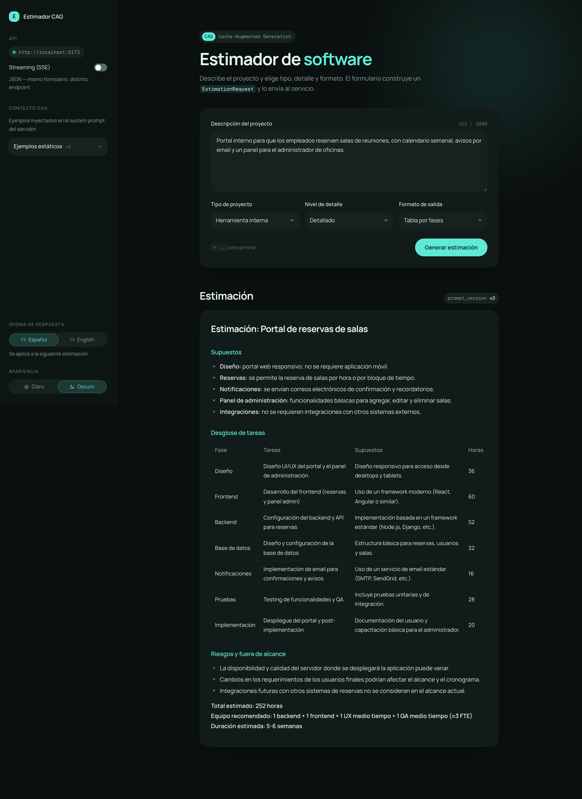
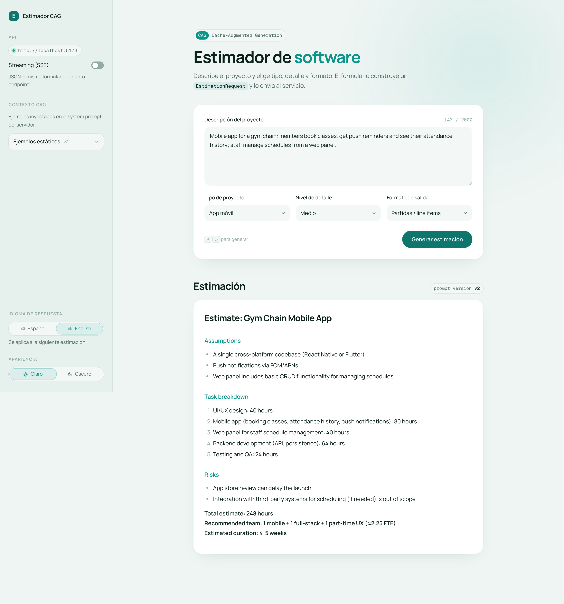

# estimador-cag

Software project effort estimator using **CAG** (Cache-Augmented Generation): curated example
estimates are injected into the system prompt, and an LLM turns a project description into a
Markdown estimate (assumptions, task breakdown, total hours, team and duration).

| Dark · Spanish response · detailed, table by phases | Light · English response · medium, line items |
|---|---|
|  |  |

- **API:** FastAPI + OpenAI (`app/`), JSON and SSE streaming endpoints.
- **UI:** React 19 + TypeScript + Tailwind v4 on Vite (`web/`). Dark by default, light/dark
  toggle, language toggle (Español / English) for both the UI copy and the model response.
- **Prompts:** versioned Jinja2 templates in English (`app/prompts/estimation/v2/`); the model
  answers in the language selected in the sidebar.

## Requirements

- Python 3.13 with [uv](https://docs.astral.sh/uv/)
- **Node 24 LTS** (pinned in `.nvmrc`: run `nvm use`) and **pnpm 10** (the repo is a pnpm workspace;
  `npm install` is blocked on purpose). With Node 24, `corepack enable pnpm` installs the pinned pnpm.
- An OpenAI API key

## Setup

```bash
nvm use                # Node 24 from .nvmrc
uv sync                # Python dependencies
pnpm install           # JS dependencies (whole workspace) + the pre-commit hook
cp .env.example .env   # then set OPEN_API_KEY
```

## Run

```bash
pnpm dev
```

Starts the API (FastAPI with `--reload`, http://127.0.0.1:8000, docs at `/docs`) and the UI
(Vite, **http://localhost:5173**) in one terminal, with `[api]` / `[web]` prefixed logs. `Ctrl+C`
stops both; if one fails (e.g. port 8000 in use) the other stops too. To run them separately:
`pnpm dev:api` and `pnpm dev:web`.

In development Vite proxies `/api` and `/health` to the API, so the UI uses relative URLs and
no CORS setup is needed.

**Single process (production-like):**

```bash
pnpm build                   # builds web/dist
uv run uvicorn app.main:app  # serves the API and, when web/dist exists, the UI at /
```

## Tests

```bash
pnpm test            # everything: API (pytest) then UI (Vitest)
pnpm test:api        # API only
pnpm test:web        # UI only
pnpm test:watch      # UI in watch mode
pnpm test:coverage   # coverage for both
pnpm lint            # ESLint (pnpm build also type-checks)
```

Tests never call the real LLM: the API tests use a fake provider (and fail if anything reaches the
OpenAI SDK), and the UI tests mock `web/src/api/client.ts`. The prompt template tests in
`tests/prompts/` render the templates only and run in milliseconds.

### Pre-commit hook

`pnpm install` installs a git hook (Husky + lint-staged) that runs **the same checks as CI** on
every commit and blocks it if anything fails. CI and the hook both call the same scripts, so they
cannot drift apart:

- `scripts/ci/api.sh`: `uv sync --locked` + `pytest`
- `scripts/ci/web.sh`: `pnpm lint` + Vitest + `pnpm build` (includes the type-check)

lint-staged sets unstaged edits aside while the checks run, so they test exactly what you are
committing. A commit takes ~25 s. The hook needs `uv` and `pnpm` on your `PATH`.

## Pull requests

`main` is protected: no direct pushes (admins included); every change goes through a pull request
that must pass CI (`.github/workflows/ci.yml`) and be up to date with `main`:

- `api-tests`: `scripts/ci/api.sh`
- `web-tests`: `pnpm install --frozen-lockfile` + `scripts/ci/web.sh`

[CodeRabbit](https://coderabbit.ai) reviews PRs using `.coderabbit.yaml`, but **only on request**:
CodeRabbit does not auto-review public repositories with fewer than 10 stars
([docs](https://docs.coderabbit.ai/management/plans)). After opening a PR (and after pushing
significant changes), ask for a review with one of:

- `@coderabbitai review`: incremental review of the latest changes
- `@coderabbitai full review`: review the whole PR from scratch
- or tick **Trigger review** in CodeRabbit's status comment on the PR

Its status check shows "Review skipped" until a review is requested; it never blocks the merge.
Small open-source repos are limited to about one CodeRabbit review per hour.

## API

| Method | Path | Response |
|--------|------|----------|
| `GET` | `/health` | `{"status": "ok"}` |
| `POST` | `/api/v1/estimate` | `EstimationResponse` (`text`, `prompt_version`) |
| `POST` | `/api/v1/estimate/stream` | SSE events: `token`, `done` (model, tokens, latency, `prompt_version`), `error` |
| `GET` | `/api/v1/context` | `PromptContextResponse` (`prompt_version`, `examples_markdown`) |

```bash
curl -X POST http://127.0.0.1:8000/api/v1/estimate \
  -H 'Content-Type: application/json' \
  -d '{
    "description": "E-commerce web MVP with a catalog, cart and Stripe payments",
    "project_type": "web_saas",
    "detail_level": "medium",
    "output_format": "phases_table",
    "language": "en"
  }'
```

- `project_type`: `mobile_app` | `web_saas` | `internal_tool` | `data_pipeline`
- `detail_level`: `summary` | `medium` | `detailed`
- `output_format`: `phases_table` | `line_items` | `narrative`
- `language` (optional): `es` (default) | `en`. Unsupported values fall back to `es`.

Provider failures return **502** with a safe message, prompt misconfiguration **500**, invalid
input **422**. In the stream, failures arrive as an `error` event.

## Prompts

`app/prompts/estimation/<version>/` holds the templates; `PROMPT_VERSION` in
`app/prompts/loader.py` selects the active one (`v2`; `v1` is the original Spanish prompt, kept
for comparison). The system prompt is a static prefix (rules + few-shot examples, identical for
every request, so the provider can cache it) followed by two short blocks: `request.j2` (the
chosen detail level and output format) and `language.j2` (the response language). The project
description only goes in `user.j2`.

## Project structure

```
app/
├── main.py               # FastAPI app, middleware, exception handlers, serves web/dist
├── config.py             # Settings (the only place that reads env vars)
├── dependencies.py       # Depends providers (overridable in tests)
├── exceptions.py         # Domain errors → HTTP status codes
├── logging_config.py     # structlog: console in development, JSON in production
├── prompts/              # Versioned Jinja2 templates + loader
├── routers/              # HTTP / SSE endpoints
├── schemas/              # Pydantic request/response models
└── services/             # EstimationService + LLM providers (services/llm/)
tests/                    # pytest (API + prompt templates)
web/src/
├── api/                  # HTTP/SSE client + types (mirror of app/schemas)
├── components/           # Sidebar, form, result, toggles
├── hooks/                # useEstimation, useTheme, useResponseLanguage
└── test/                 # Vitest setup and fixtures
scripts/                  # dev runner, pnpm-only install guard
docs/architecture/        # Architecture diagrams (archify source + rendered HTML)
docs/screenshots/         # README screenshots
docs/samples/             # Copy-paste project descriptions for manual UI checks
```

Contributor rules (layers, conventions, recipes, definition of done) live in
[AGENTS.md](AGENTS.md).

**Architecture diagram:** [view it interactive on GitHub](https://htmlpreview.github.io/?https://github.com/bradguillen15/estimador-cag/blob/main/docs/architecture/estimation-flow/estimation-flow.html)
(via htmlpreview), or open [the HTML file](docs/architecture/estimation-flow/estimation-flow.html)
locally in a browser.

## Logging

Every LLM call logs `llm_call_started` / `llm_call_completed` / `llm_call_failed` with latency,
tokens and estimated cost, plus a `request_id` per HTTP request.

- `APP_ENV=development`: readable console; `APP_ENV=production`: one JSON line per event
- `LOG_LEVEL` is required in `.env`
